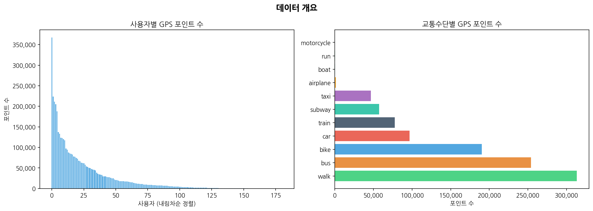
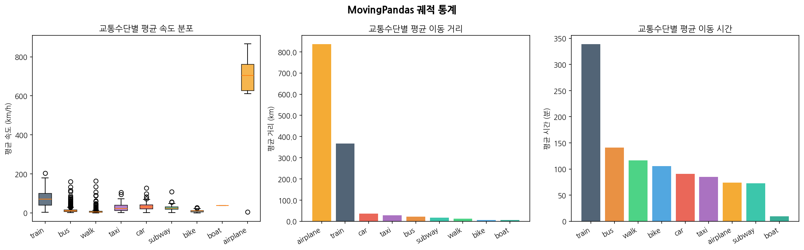
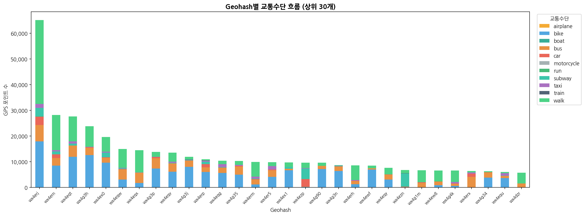
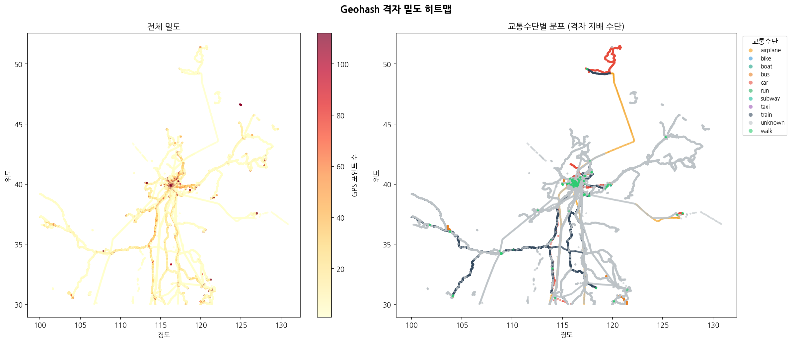
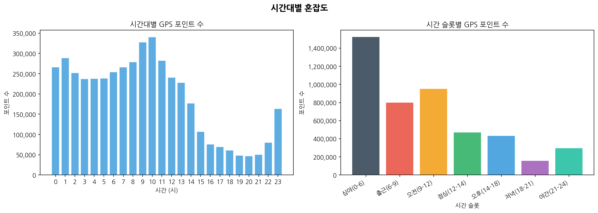
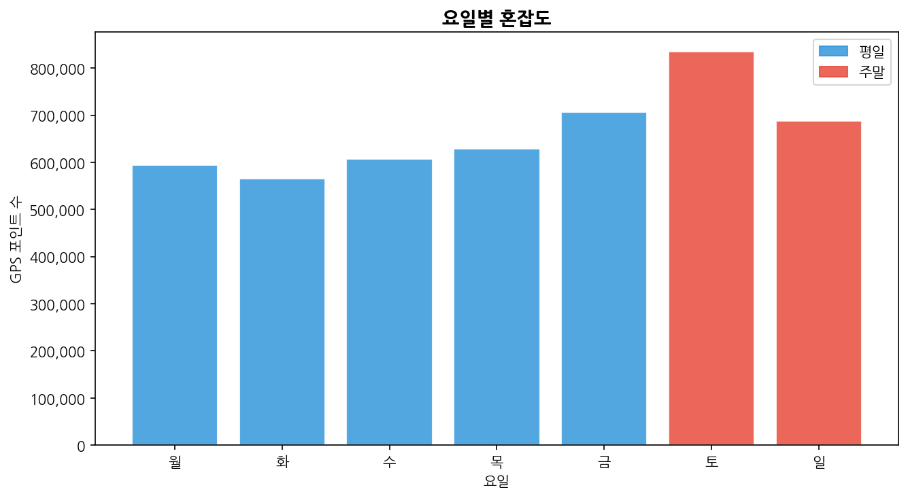
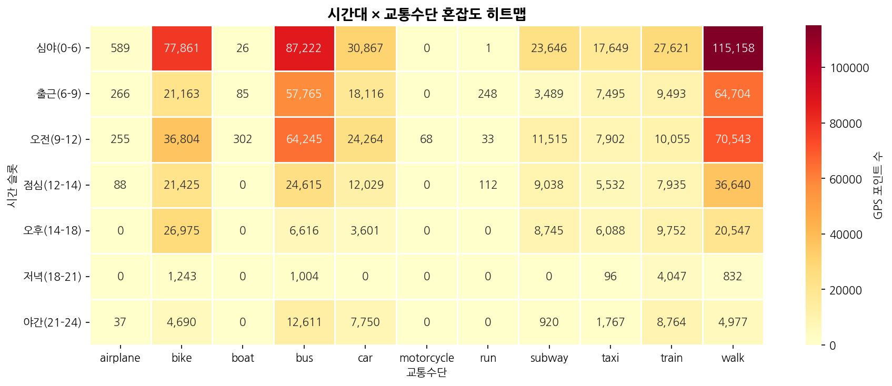
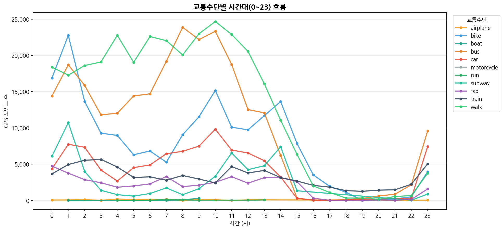
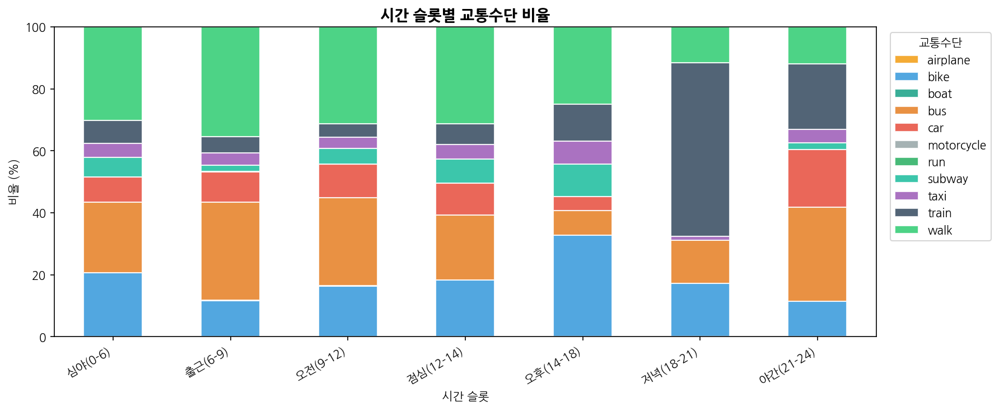
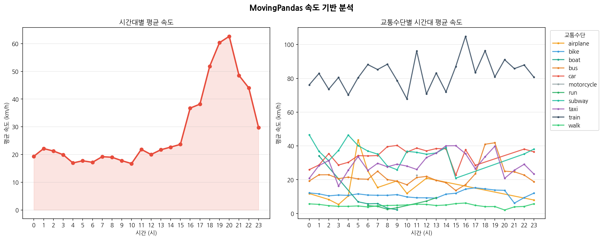

# Trajectory CNN — GPS 궤적 기반 교통수단 분류

GeoLife GPS 데이터셋을 활용해 이동 궤적에서 교통수단(walk, bike, bus, car 등)을 분류하는 CNN 모델 개발 프로젝트입니다.
본 문서에서는 **EDA(탐색적 데이터 분석)** 단계의 주요 시각화 결과를 정리합니다.

---

## 데이터셋

- **출처**: Microsoft Research GeoLife GPS Trajectory Dataset
- **구성**: 182명의 사용자, 약 1,700만 개 GPS 포인트
- **교통수단 레이블**: walk, bike, bus, car, taxi, subway, train, boat, run, motorcycle, airplane
- **분석 도구**: `MovingPandas`, `geohash`, `pandas`, `matplotlib`

---

## EDA 결과

### 1. 데이터 개요



- **(좌) 사용자별 GPS 포인트 수**: 소수의 활성 사용자가 데이터의 대부분을 차지하는 롱테일 분포. 상위 몇 명의 사용자가 35만 포인트 이상을 기록.
- **(우) 교통수단별 GPS 포인트 수**: `walk`가 가장 많고, 이어서 `bus`, `bike` 순. `motorcycle`, `run`, `boat`는 데이터가 극히 적어 클래스 불균형이 심함.

---

### 2. MovingPandas 궤적 통계



MovingPandas `TrajectoryCollection`으로 변환한 레이블 궤적들의 통계.

- **(좌) 교통수단별 평균 속도 분포**: `airplane`이 압도적으로 빠르며(평균 700km/h 이상), `train`, `bus`, `walk` 순. 박스플롯을 통해 이상치도 확인 가능.
- **(중) 교통수단별 평균 이동 거리**: `airplane`(~850km), `train`(~350km)은 장거리 이동. 나머지 수단은 50km 미만으로 단거리 중심.
- **(우) 교통수단별 평균 이동 시간**: `train`이 약 340분으로 가장 길고, `boat`가 약 15분으로 가장 짧음.

---

### 3. Geohash별 교통수단 흐름 (상위 30개)



위도·경도를 Geohash(precision=6, 약 1.2km × 0.6km 격자)로 변환해 지역별 교통 흐름을 분석.

- 최상위 Geohash(`wx4eri`)에서 약 65,000개 포인트가 집중 — 베이징 중심부에 해당.
- 모든 고밀도 격자에서 `walk`(초록)와 `bike`(파랑)가 지배적이며, 버스·지하철 등 대중교통이 그 뒤를 이음.
- 데이터가 베이징 권역에 집중됨을 확인.

---

### 4. Geohash 격자 밀도 히트맵



- **(좌) 전체 밀도**: 위도 39~40°, 경도 116~117° 부근(베이징 시내)에 데이터가 극도로 집중.
- **(우) 교통수단별 분포**: 지배적인 교통수단을 색상으로 표시. 도심 내 `walk`·`bike` 위주, 도시 외곽으로 갈수록 `train`·`car` 등이 나타남.

---

### 5. 시간대별 혼잡도



- **(좌) 시간(0~23시)별 GPS 포인트 수**: 오전 9~11시에 두드러진 피크(약 34만 포인트). 새벽 0~1시에도 높은 수치가 나타나 심야 활동 데이터가 포함됨.
- **(우) 시간 슬롯별 포인트 수**: 심야(0~6시)가 약 150만 포인트로 가장 많음 — 데이터 수집 특성상 심야에도 GPS가 켜져 있던 사용자가 많았기 때문.

---

### 6. 요일별 혼잡도



- 평일(월~금)은 약 60~70만 포인트로 비교적 균일.
- **토요일**이 약 84만 포인트로 가장 높음 — 주말 야외 활동 증가 반영.
- 일요일도 약 69만으로 평일보다 높아 주말 효과가 뚜렷.

---

### 7. 시간대 × 교통수단 혼잡도 히트맵



시간 슬롯(행) × 교통수단(열) 조합별 GPS 포인트 수를 수치와 색상으로 표현.

- `walk`(심야 115,158)와 `bus`(심야 87,222)가 심야 슬롯에서 가장 활발.
- `bike`는 심야와 오전에 집중, `car`는 출근~오전 구간에 상대적으로 많음.
- `motorcycle`, `boat`, `run`은 거의 모든 슬롯에서 0에 가까워 학습 데이터로 사용하기 어려움.

---

### 8. 교통수단별 시간대(0~23시) 흐름



각 교통수단의 시간별 GPS 포인트 수를 라인 그래프로 시각화.

- `bus`(주황)가 오전 9~12시에 최고조(25,000포인트)로, 출퇴근 피크가 명확.
- `walk`(연두)와 `bike`(파랑)는 주간에 전반적으로 높은 수준 유지.
- `train`(남색)은 전 시간대에 걸쳐 낮고 안정적인 패턴.

---

### 9. 시간 슬롯별 교통수단 비율



각 시간 슬롯에서 교통수단이 차지하는 비율(%)을 100% 누적 막대 그래프로 표현.

- 심야~오전은 `bus`와 `walk` 비율이 높고, `bike`도 상당 비중 차지.
- **저녁(18~21시)**: `train`이 약 57%로 급증 — 장거리 귀가 수요 반영.
- **야간(21~24시)**: `car`와 `train` 비율이 높아지며, 대중교통 감소에 따른 자차 의존도 증가.

---

### 10. MovingPandas 속도 기반 분석



MovingPandas로 계산한 궤적별 속도(km/h)를 시간대별로 분석.

- **(좌) 시간대별 평균 속도**: 오후 17~20시에 60km/h 이상으로 급상승 — 퇴근 시간대에 고속 이동(자차·기차 등) 활동이 집중됨.
- **(우) 교통수단별 시간대 평균 속도**: `train`(남색)이 80~100km/h로 항상 최고속. `car`, `taxi`, `bus`는 20~40km/h 수준에서 시간대에 따라 변동.

---

## 프로젝트 구조

```
trajectory-cnn/
├── data/                    # GeoLife 원본 데이터
├── src/
│   ├── data_loader.py       # 데이터 로드 및 MovingPandas 변환
│   ├── geohash_utils.py     # Geohash 격자화
│   └── eda.py               # EDA 시각화 함수
├── outputs/
│   └── figures/             # EDA 결과 이미지 (01~10)
└── main_eda.py              # EDA 실행 진입점
```

## 실행 방법

```bash
# EDA 실행
python main_eda.py
```

---

## 다음 단계

- [ ] CNN 모델 설계 (시계열 궤적 → 이미지 변환 or 1D CNN)
- [ ] 클래스 불균형 처리 (오버샘플링 / 클래스 가중치)
- [ ] 교통수단 분류 모델 학습 및 평가
